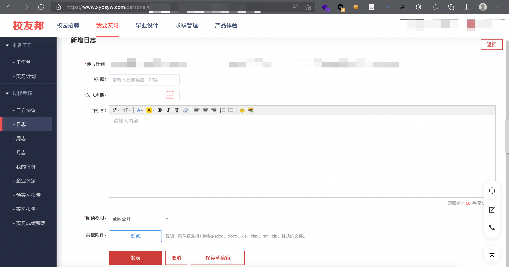
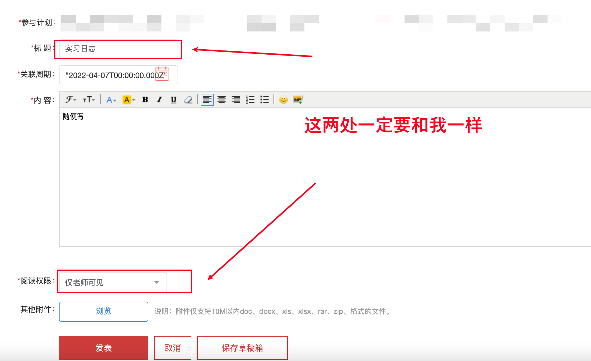
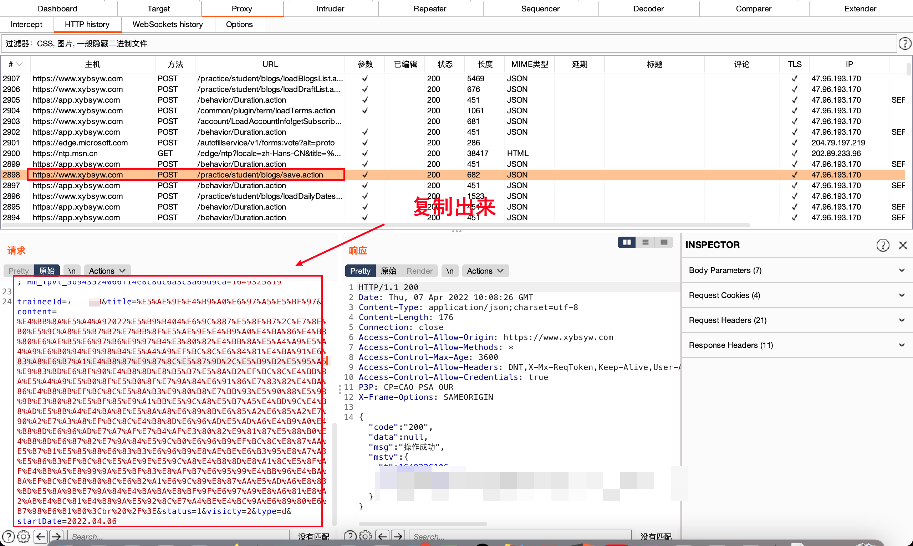
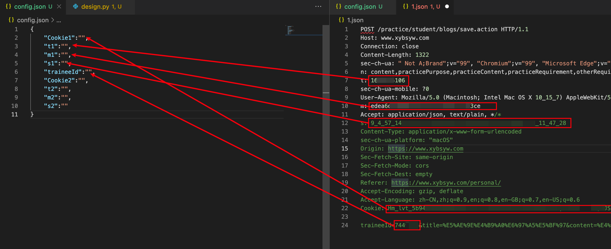
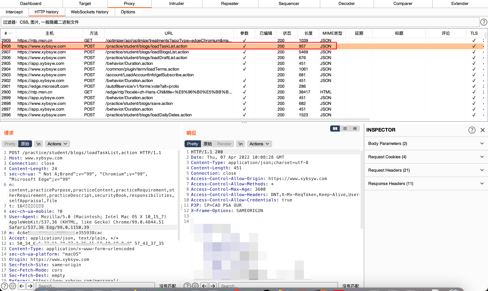
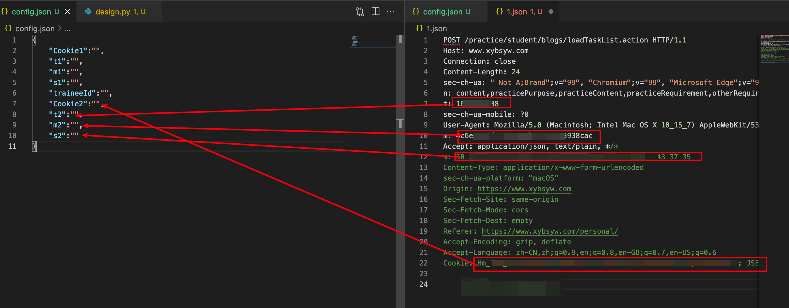
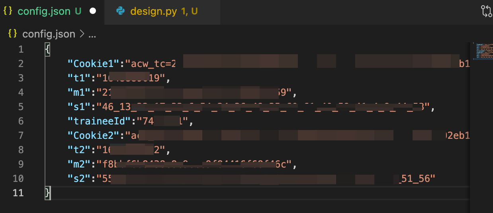
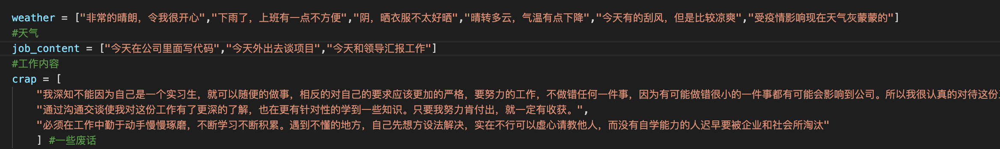
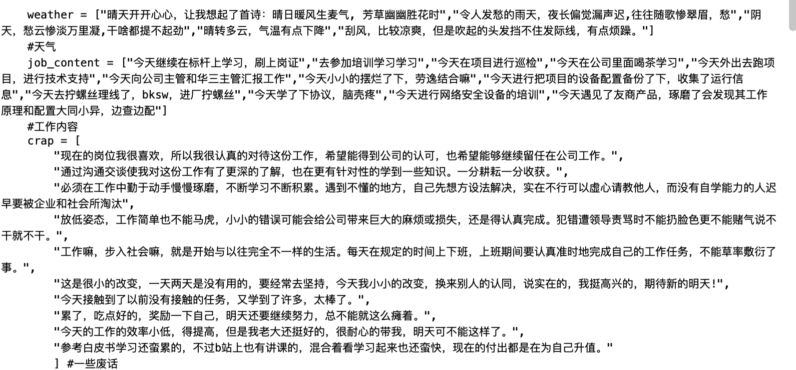
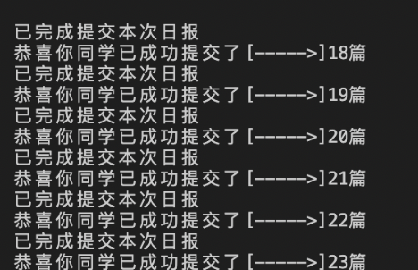

# XYB_The_Log

## 配置方法一定要仔细看

## 一、配置自己的密钥

首先我们就使用电脑登陆网页XYB

https://www.xybsyw.com/


然后我们进入提交日记的地方



按照我下图的模版来输入。



然后不要着急提交，打开抓包软件，这里使用的是Burp


然后我们在包当中找到save.action开头的



将这个复制到文本当中，就能非常方便的加入到配置文件当中，按照下图，我们将内容填入config.json里面



第二个配置信息是在loadTaskList.action页面当中读取



同样复制到一个空的文件当中好配置



如下图这样配置就行了。



## 二、编辑好了自己的日记套话

如下图所示，大家要重点将这里配置好，他会随机生成日志，这些是需要自己随便填写一下。还给大家加入了一点模版。

```
    weather = ["非常的晴朗，令我很开心","下雨了，上班有一点不方便","阴，晒衣服不太好晒","晴转多云，气温有点下降","今天有的刮风，但是比较凉爽","受疫情影响现在天气灰蒙蒙的"]
    #天气
    job_content = ["今天在公司里面写代码","今天外出去谈项目","今天和领导汇报工作"]
    #工作内容
    crap = [
        "我深知不能因为自己是一个实习生，就可以随便的做事，相反的对自己的要求应该更加的严格，要努力的工作，不做错任何一件事，因为有可能做错很小的一件事都有可能会影响到公司。所以我很认真的对待这份工作，希望能得到公司的认可，也希望能够继续留任在公司工作。",
        "通过沟通交谈使我对这份工作有了更深的了解，也在更有针对性的学到一些知识。只要我努力肯付出，就一定有收获。",
        "必须在工作中勤于动手慢慢琢磨，不断学习不断积累。遇到不懂的地方，自己先想方设法解决，实在不行可以虚心请教他人，而没有自学能力的人迟早要被企业和社会所淘汰"
        ] #一些废话
```





## 三、注意时间

说白了，因为懒，没有加上自动化从实习开始到结束自动提交的语句，所以需要手动变一下月份和实习的日子


# 最后成品

```
python3 design.py
```



# 悄悄话

如果有用的话，请点个小星星可好？
